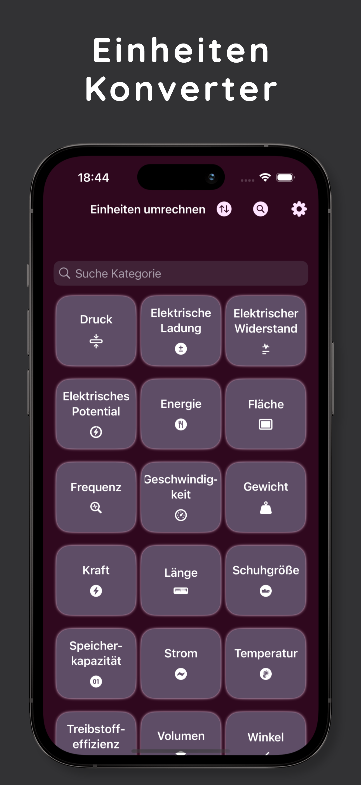
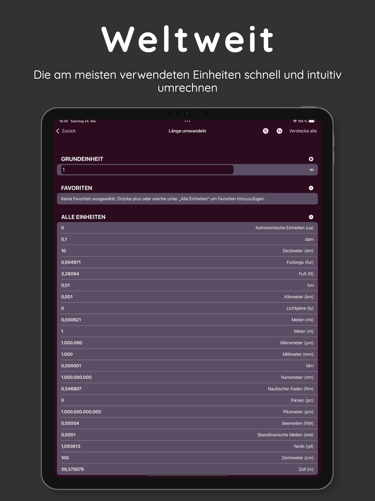
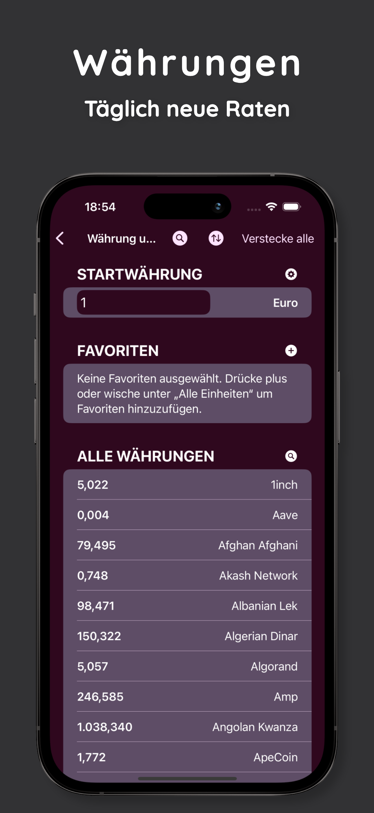
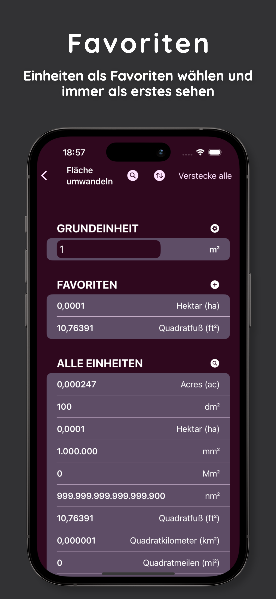
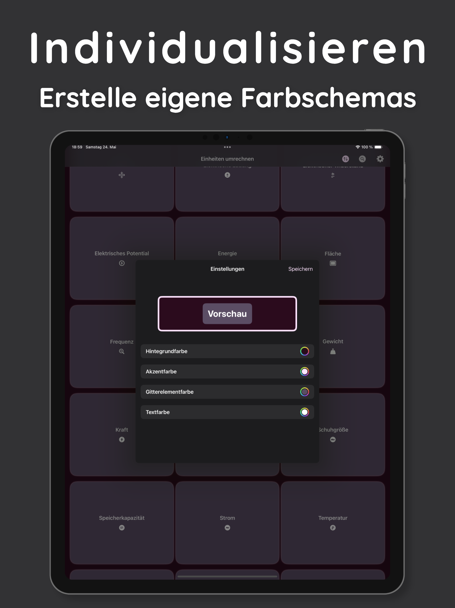

# 🌍 EinheitenUmrechner – Dein smarter Helfer für Einheiten und Währungen

**EinheitenUmrechner** ist eine einfache, schnelle und intuitive iOS-App, mit der du weltweit gängige **Einheiten** und **Währungen** umrechnen kannst – jederzeit und überall.


---

## ✨ Funktionen

- 💱 **Währungsumrechnung** mit aktuellen Wechselkursen
- 📐 **Einheitenrechner** für:
  - Länge (Meter, Meilen, Fuß, Zoll, ...)
  - Gewicht (Kilogramm, Pfund, Unzen, ...)
  - Temperatur (Celsius, Fahrenheit, Kelvin)
  - Volumen, Fläche, Geschwindigkeit, Energie, Zeit u.v.m.
- 🌐 **International nutzbar**
- 🧠 **Intuitives Design** mit klarer Benutzerführung
- 📶 **Offline-Verfügbarkeit** für Einheitenumrechnung ohne Internet
- 📲 **Optimiert für iPhone und iPad**

---

## 🔧 Technologie

- **Programmiert in:** Swift & SwiftUI
- **Systemanforderung:** iOS 17.0 oder neuer
- **Wechselkurse:** Bezogen über eine API unter [Creative Commons CC0 1.0 Universal Lizenz](https://creativecommons.org/publicdomain/zero/1.0/)

---

## 📷 Screenshots

<p float="left">
  
  
  
  
  
</p>

---

## 📥 Installation

Du kannst die App direkt aus dem App Store laden:  
👉 **[Comming soon]**

Oder das Projekt lokal kompilieren:

```bash
git clone https://github.com/michafdlr/EinheitenUmrechner.git
open EinheitenUmrechner.xcodeproj
```
---

## ❓ Häufige Fragen (FAQ)

**🔌 Braucht die App eine Internetverbindung?**  
Nein – Einheitenumrechnung funktioniert vollständig offline. Nur die Wechselkurse werden online aktualisiert.

**🔐 Werden persönliche Daten gespeichert?**  
Nein. Die App erhebt oder speichert **keinerlei** personenbezogene Daten.

**🔄 Wie aktuell sind die Wechselkurse?**  
Die Kurse stammen von einer zuverlässigen API und werden regelmäßig aktualisiert. Die Daten sind gemeinfrei (CC0 lizenziert).

---

## 🛟 Support & Kontakt

Bei Fragen, Verbesserungsvorschlägen oder Fehlern:  
Erstelle ein [GitHub Issue](https://github.com/michafdlr/EinheitenUmrechner/issues)

---

## 📄 Lizenz

- Die App verwendet Daten, die unter der **[Creative Commons CC0 1.0 Universal Lizenz (Public Domain)](https://creativecommons.org/publicdomain/zero/1.0/)** stehen.
- Der Quellcode dieses Projekts steht unter der **MIT-Lizenz**.  

---

## 💡 Mitwirken

Pull Requests und Verbesserungsvorschläge sind willkommen. Bei Interesse bitte vorher ein Issue eröffnen.

---

## 🚀 Jetzt loslegen

Lade **EinheitenUmrechner** im App Store herunter und genieße sorgenfreies Umrechnen – weltweit und offline!

---

## ❓ Frequently Asked Questions (FAQ)

**🔌 Does the app require an internet connection?**  
No – unit conversions work completely offline. Only currency exchange rates are updated online.

**🔐 Does the app store any personal data?**  
No. The app does **not collect or store any personal information**.

**🔄 How up-to-date are the exchange rates?**  
Exchange rates are sourced from a reliable API and updated regularly. The data is in the public domain (CC0 licensed).

---

## 🛟 Support & Contact

Open a [GitHub Issue](https://github.com/michafdlr/EinheitenUmrechner/issues)

---

## 📄 License

- This app uses data provided under the **[Creative Commons CC0 1.0 Universal Public Domain Dedication](https://creativecommons.org/publicdomain/zero/1.0/)**.
- The source code of this project is licensed under the **MIT License**.  

---

## 💡 Contributing

Pull requests and suggestions are welcome! If you’d like to contribute, please open an issue first to discuss any changes.

---

## 🚀 Get Started

Download **EinheitenUmrechner** from the App Store and enjoy seamless conversions – anytime, anywhere!
